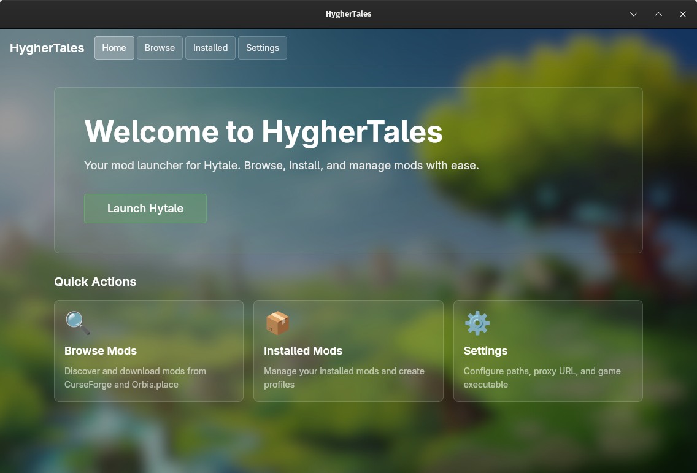

# HygherTales



Mod launcher for Hytale. Browse and install mods from CurseForge and Orbis.place, manage profiles, and optionally launch the game(WIP).

## DISCLAIMER

- This project is not affiliated with Hypixel or Hytale.
- The project is still in development and is not yet ready for use.
- The project was developed using AI agents

## What it does

- Browse mods from CurseForge and Orbis.place
- Download and install mods to your Hytale Mods folder
- Enable/disable mods and check for updates
- Create profiles to switch mod sets
- Export/import profiles as JSON
- Launch Hytale (optional, requires legally installed game)

## What it does not do

- No game files included or downloaded
- No authentication bypass
- No DRM circumvention

---

## Installation

Pick the latest release from [releases](https://github.com/MemerGamer/HygherTales/releases) and download the appropriate binary for your platform.

### Linux: blank or white window

On some setups the AppImage shows a blank/white window (WebKit/EGL issue). Try:

1. **Use the .deb or .rpm package** from the same release instead of the AppImage; native packages often avoid this.
2. If you must use the AppImage, run with:
   ```bash
   WEBKIT_DISABLE_COMPOSITING_MODE=1 GDK_BACKEND=x11 ./HygherTales_*.AppImage
   ```
   If it still stays blank, the .deb is the most reliable option.

## Development guide
## Prerequisites

- [Bun](https://bun.sh) - JavaScript runtime
- [Rust](https://rustup.rs) - for desktop builds

Linux desktop builds require: `webkit2gtk-4.1-dev`, `libappindicator3-dev`, `librsvg2-dev`, `patchelf`

---

## Quick start

```bash
bun install
bun run dev:all
```

Before running:

1. `cp apps/proxy/.env.example apps/proxy/.env`
2. Set `CURSEFORGE_API_KEY` (get from [CurseForge](https://support.curseforge.com/en/support/solutions/articles/9000208346))
3. Set `CURSEFORGE_GAME_ID=70216` (Hytale)

The proxy runs at `http://localhost:8787` and the desktop opens automatically.

---

## Development

**Proxy only:**

```bash
bun run dev:proxy
```

**Desktop only:**

```bash
bun run dev
```

**Build all:**

```bash
bun run build
```

**Lint:**

```bash
bun run lint
```

---

## Docker (proxy)

Build from repo root:

```bash
docker build -f apps/proxy/Dockerfile -t hyghertales-proxy .
```

Run (secrets via env):

```bash
docker run -p 8787:8787 \
  -e CURSEFORGE_API_KEY=your_key \
  -e CURSEFORGE_GAME_ID=70216 \
  hyghertales-proxy
```

Optional env: `CORS_ORIGINS`, `RATE_LIMIT_PER_MIN`, `PORT`. See [apps/proxy/README.md](apps/proxy/README.md).

---

## Using a hosted proxy

If you deploy the proxy to a server:

1. Desktop app → Settings → Proxy base URL → `https://proxy.example.com`
2. Ensure proxy's `CORS_ORIGINS` allows desktop requests

The desktop never has the API key. All CurseForge calls go through the proxy.

---

## Troubleshooting

**Proxy returns 403:**  
Missing or invalid `CURSEFORGE_API_KEY`. Get a key from CurseForge (see [apps/proxy/README.md](apps/proxy/README.md)).

**Desktop can't reach proxy:**  
Check Settings → Proxy base URL. Default is `http://localhost:8787`.

**Mods folder permission denied:**  
Desktop can't write to the Mods directory. Use Settings → Validate to create it or check permissions.

---

## Distribution

Release-please manages versions and releases. CI builds:
- Desktop installers (Windows `.msi`, macOS `.dmg`, Linux `.deb`/`.AppImage`)
- Proxy Docker image

See [RELEASE_CHECKLIST.md](RELEASE_CHECKLIST.md) for deployment steps.

---

## Repository structure

```
apps/
  desktop/   # Tauri v2 + React + Vite + Tailwind v4
  proxy/     # Bun + Hono (CurseForge + Orbis.place APIs)
packages/
  shared/    # TypeScript + Zod (schemas and types)
```

## License

See [LICENSE](LICENSE).
